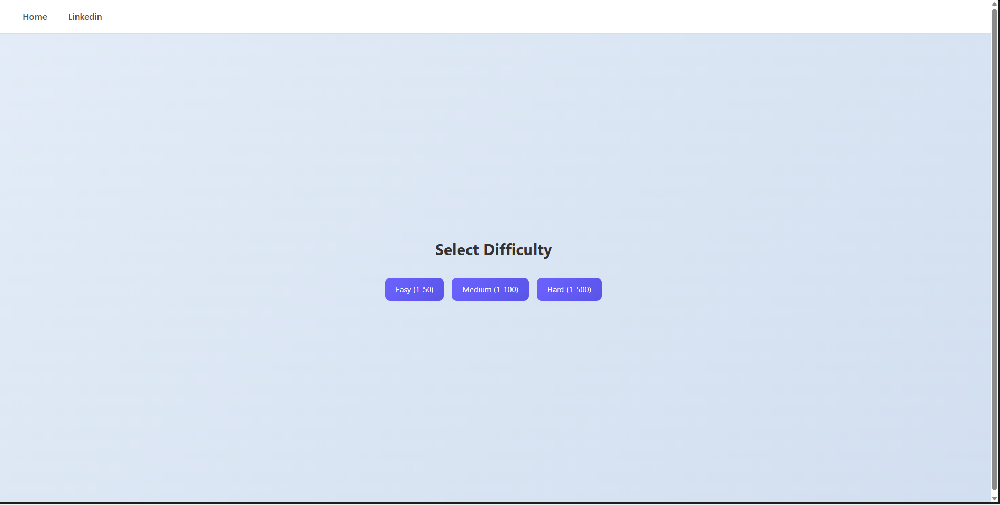
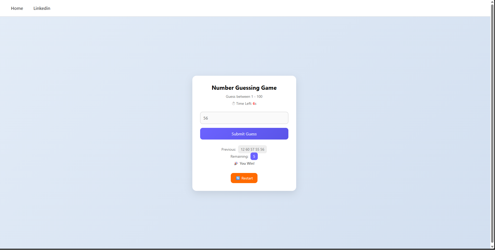

# -Number-Guessing-Game
A fun and interactive Number Guessing Game built using HTML, CSS, and JavaScript. Test your guessing skills with multiple difficulty levels, timer, and smart hints!
---

## 🚀 Features

* 🎮 **Multiple Difficulty Levels**

  * Easy (1–50)
  * Medium (1–100)
  * Hard (1–500)

* ⏱ **30-Second Timer**

  * Guess before time runs out!

* 🔥 **Smart Hints**

  * Too High / Too Low
  * "Very Close" feedback based on difficulty

* 🚫 **Duplicate Guess Detection**

  * Prevents repeated guesses

* 🔢 **Limited Attempts**

  * Maximum 10 guesses per game

* 🔊 **Sound Effects**

  * Click sound
  * Win sound
  * Lose sound

* 🔄 **Restart Anytime**

  * Reset and choose difficulty again

---

## 🛠️ Tech Stack

* **HTML5** – Structure
* **CSS3** – Styling & UI
* **JavaScript (Vanilla)** – Game Logic

---

## 📂 Project Structure

```
📁 project-folder
│── index.html
│── style.css
│── guess.js
│
└── 📁 sounds
    ├── click.mp3
    ├── win.mp3
    └── fail.mp3
```

---

## 🎮 How to Play

1. Select a **difficulty level**
2. Start guessing the number within the given range
3. Use hints to adjust your guesses:

   * 📈 Too High
   * 📉 Too Low
   * 🔥 Very Close
4. Win by guessing correctly within:

   * ⏱ Time limit (30 seconds)
   * 🎯 10 attempts

---

## 🧠 Key Concepts Used

* DOM Manipulation
* Event Handling
* Arrays & State Management
* Conditional Logic
* Timers (`setInterval`)
* UI Updates Dynamically

---

## 💡 Future Improvements

* 🎉 Confetti animation on win
* 📊 Score tracking system
* 🏆 Leaderboard
* 🌙 Dark mode
* 📱 Mobile vibration feedback

---

## 📸 Preview

## Difficulty Screen 



## Won Screen 




---

## 🙌 Author

**Vishesh Khanna**

* 💼 LinkedIn: https://www.linkedin.com/in/vishesh-khanna-210361252

---

## ⭐ Show Your Support

If you liked this project, consider giving it a ⭐ on GitHub!
